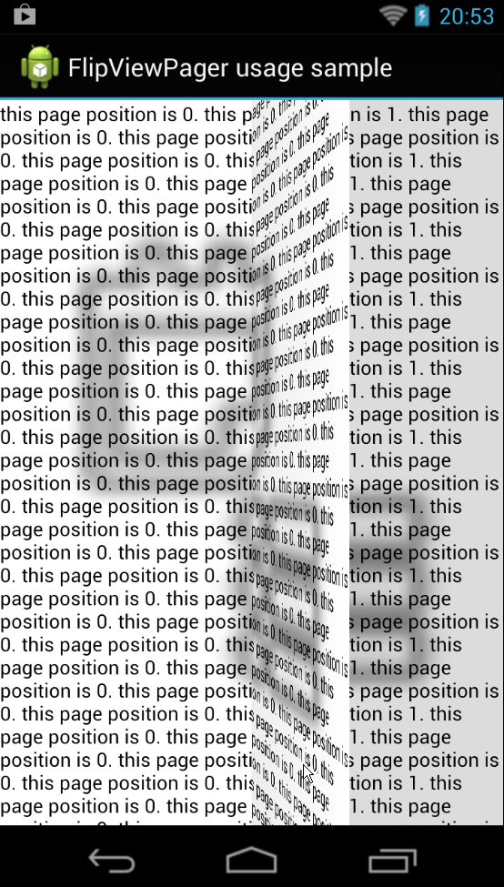

FlipViewPager
============

FlxxBoardのようなページ捲りインタフェースを実現できるViewPagerです。

使い方
=====
ViewPagerをベースに作ったウィジェットなので、基本的にViewPagerと同じ使い方です。
詳しくはサンプルプロジェクトを参照してください。

activity(.java)

    this.pager = (FlipViewPager)findViewById(R.id.flipviewpager);
    this.pager.setAdapter(new PagerAdapter() {
    	private final LayoutInflater inflater;
    	{
	        this.inflater = (LayoutInflater) MainActivity.this.getSystemService(Context.LAYOUT_INFLATER_SERVICE);
    	}
    	
		@Override public boolean isViewFromObject(View arg0, Object arg1) {
			return arg0 == arg1;
		}
		
		@Override public int getCount() {
			return 10;
		}
		
		@Override public Object instantiateItem(ViewGroup container, int position) {
			final FrameLayout v = (FrameLayout) inflater.inflate(R.layout.activity_main_pager_item, null);
			
			final TextView  text  = (TextView )v.findViewById(R.id.text);
			StringBuilder sb = new StringBuilder();
			for (int i = 0; i < 100; i++) {
				sb.append("this page position is " + position + ". ");
			}
			text.setText(sb.toString());
			
			final ImageView image = (ImageView)v.findViewById(R.id.image);
			
			container.addView(v);
			return v;
		}
		
		@Override public void destroyItem(ViewGroup container, int position, Object object) {
			//TODO 
		}
	});
	
layout(.xml)

	<LinearLayout xmlns:android="http://schemas.android.com/apk/res/android"
	    xmlns:tools="http://schemas.android.com/tools"
	    android:layout_width="match_parent"
	    android:layout_height="match_parent"
	    android:orientation="vertical"
	    tools:context=".MainActivity" >

	    <t3.giftbook.util.FlipViewPager
			android:id="@+id/flipviewpager"
			android:layout_width="match_parent"
			android:layout_height="match_parent"
		/>

	</LinearLayout>
	
